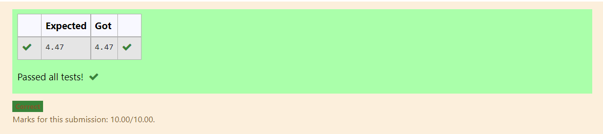

# DISTANCE-BETWEEN-TWO-POINTS

## AIM:
To write a python program to find the distance two 2 points
## ALGORITHM:
### Step 1: 
Import math module
### Step 2: 
Assign values as list
### Step 3: 
Substitute the values in the distance formula  
### Step 4: 
End the program

### PROGRAM:
```
#Program to find the distance between two points.
#Developed by: PRADEESH S
#RegisterNumber:21500189
import math
p=[10,4]
q=[6,2]
print(round(math.sqrt(((p[0]-q[0])**2)+((p[1]-q[1])**2)),2))
```


### OUTPUT:


### RESULT:
Thus the distance between two points is found successfully